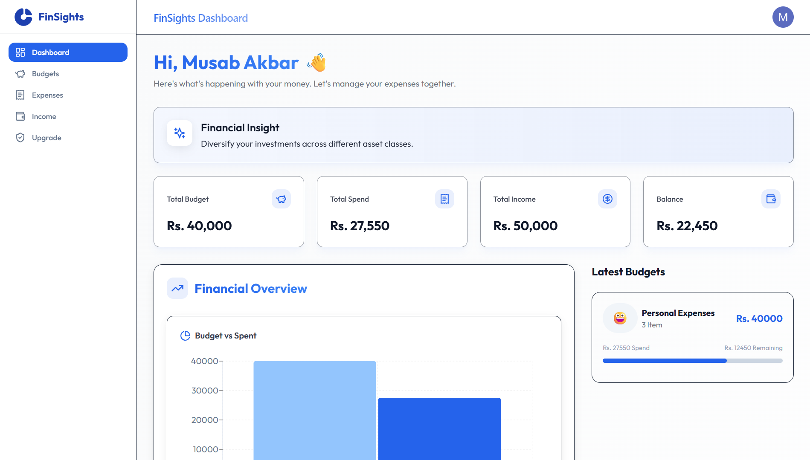

# FinSights - Smart Finance Tracking Application

FinSights is a modern personal finance tracking application that helps users manage budgets, track expenses, and monitor income streams effectively. Built with Next.js and featuring a beautiful, responsive UI, FinSights makes financial management intuitive and engaging.



## 📚 Table of Contents

- [🌟 Features](#-features)
  - [📊 Dashboard](#-dashboard)
  - [💰 Budget Management](#-budget-management)
  - [💳 Expense Tracking](#-expense-tracking)
  - [💵 Income Management](#-income-management)
  - [🔐 Security](#-security)
- [🛠️ Tech Stack](#️-tech-stack)
- [🚀 Getting Started](#-getting-started)
  - [Prerequisites](#prerequisites)
  - [Installation](#installation)
- [📁 Project Structure](#-project-structure)
- [🔧 Database Schema](#-database-schema)
- [🎨 UI/UX Features](#-uiux-features)
- [📝 License](#-license)
- [🙏 Acknowledgments](#-acknowledgments)

## 🌟 Features

### 📊 Dashboard
- Real-time financial overview
- Interactive charts and visualizations
- Quick access to recent transactions
- Budget progress tracking

### 💰 Budget Management
- Create and manage multiple budgets
- Set budget limits and track spending
- Visual progress indicators
- Budget-wise expense categorization

### 💳 Expense Tracking
- Add and categorize expenses
- Edit and delete expense entries
- Date-based expense history
- Amount tracking with currency support

### 💵 Income Management
- Track multiple income sources
- Edit income details
- Monthly income overview
- Income-expense balance tracking

### 🔐 Security
- Secure user authentication with Clerk
- Protected routes and data
- Secure database operations
- User-specific data isolation

## 🛠️ Tech Stack

- **Frontend Framework**: Next.js 14
- **Authentication**: Clerk
- **Database**: PostgreSQL with Drizzle ORM
- **Styling**: Tailwind CSS
- **UI Components**: Shadcn UI
- **Charts**: Recharts
- **Icons**: Lucide Icons
- **Animations**: Framer Motion
- **Notifications**: Sonner

## 🚀 Getting Started

### Prerequisites

- Node.js 18+ 
- PostgreSQL database
- Clerk account for authentication

### Installation

1. Clone the repository:
   ```bash
   git clone https://github.com/yourusername/finsights.git
   cd finsights
   ```

2. Install dependencies:
   ```bash
   npm install
   ```

3. Set up environment variables:
   Create a `.env.local` file in the root directory with the following variables:
   ```env
   DATABASE_URL=your_postgresql_connection_string
   NEXT_PUBLIC_CLERK_PUBLISHABLE_KEY=your_clerk_publishable_key
   CLERK_SECRET_KEY=your_clerk_secret_key
   ```

4. Initialize the database:
   ```bash
   npm run db:push
   ```

5. Start the development server:
   ```bash
   npm run dev
   ```

6. Open [http://localhost:3000](http://localhost:3000) in your browser.

## 📁 Project Structure

```
finsights/
├── app/
│   ├── (routes)/
│   │   ├── dashboard/
│   │   │   ├── budgets/
│   │   │   ├── expenses/
│   │   │   └── incomes/
│   │   └── page.jsx
│   └── _components/
├── components/
│   └── ui/
├── public/
├── utils/
│   ├── dbConfig.js
│   └── schema.js
└── package.json
```

## 🔧 Database Schema

The application uses the following main tables:

- **Budgets**: Stores budget information
- **Expenses**: Records expense transactions
- **Incomes**: Tracks income sources

## 🎨 UI/UX Features

- Modern, clean interface
- Responsive design for all devices
- Smooth animations and transitions
- Intuitive navigation
- Real-time updates
- Interactive data visualizations

## 📝 License

This project is licensed under the MIT License - see the [LICENSE](LICENSE) file for details.

## 🙏 Acknowledgments

- [Next.js](https://nextjs.org/)
- [Clerk](https://clerk.com/)
- [Drizzle ORM](https://orm.drizzle.team/)
- [Tailwind CSS](https://tailwindcss.com/)
- [Shadcn UI](https://ui.shadcn.com/)